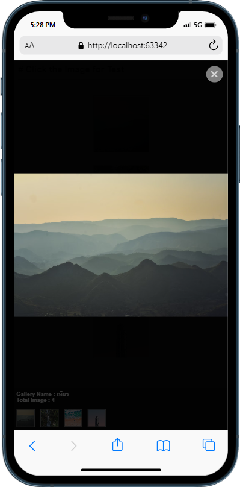

## Billie Gallery 📸

> ***Billie Gallery - Javascript Plugin*** - Project เล็ก ๆ
> ในการจัดหมวดหมู่ให้กับภาพถ่าย [@jimebillie](https://github.com/jimebillie) ออกแบบให้ดูสบายตา และ Classic สุด ๆ
> ด้วย
> CSS , JavaScript ซึ่งใช้งานง่ายมาก มีแค่ Attribute เดียวเท่านั้น !!!
> >ทดสอบ : https://3illie.github.io/gallery-plugin/DEMO.html
> 
> 

### วิธีใช้

> ถ้าจะติดตั้งด้วย **npm**
> ```npm i @jimebillie/gallery-plugin```

* **1.ไฟล์ที่สำคัญ**
    * css
    ```html
        <!--billie-gallery-css-->
        <link rel="stylesheet" href="env-3illie-gallery-plugin/css/billie-gallery.css">
        <!--.\billie-gallery-css-->
    ``` 
    * JavaScript
    ```html
      <!--billie-gallery-js-->
        <script src="env-3illie-gallery-plugin/javascript/billie-gallery.js"></script>
      <!--.\billie-gallery-js-->
    ```
* **2.ตัวอย่างการใช้ ให้ใช้กับ Tag `img`**

  * ```html
        
    ```
  > เพียงแค่เพิ่ม **Attribute** `billie-gallery` = ชื่อหมวดหมู่ที่ต้องการ ถ้าใช้ชื่อเดียวกัน จะถูกรวมกลุ่มเป็น Gallery เดียวกัน

### แจ้งปัญหาการใช้งาน
> [https://github.com/3illiE/gallery-plugin/issues](https://github.com/3illiE/gallery-plugin/issues)
